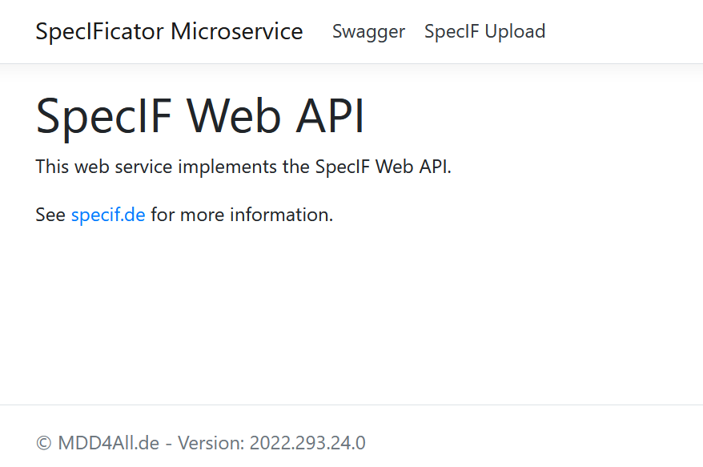
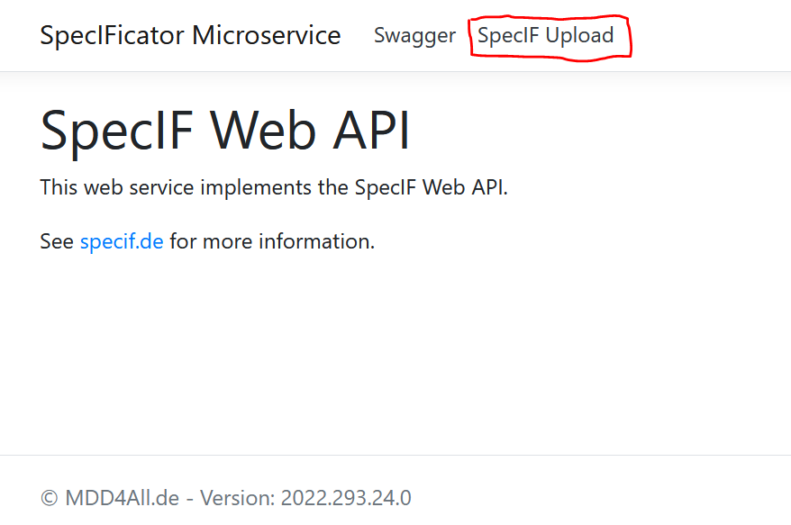
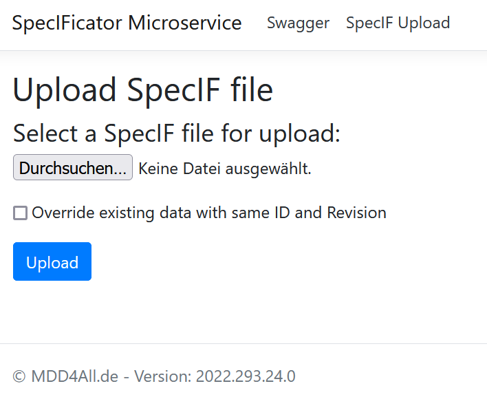
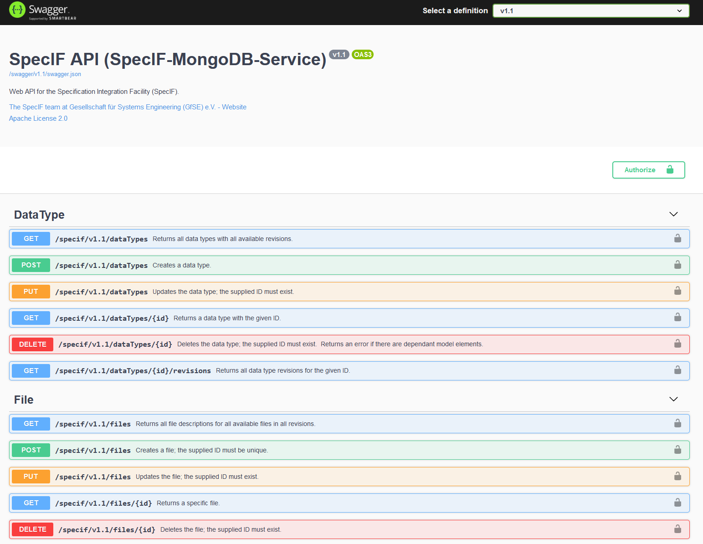

# Dockerized SpecIF-Backend

This repository contains definitions for Docker compose to run the SpecIF-Backend (WebAPI) reference implementation. Have a look at [SpecIF](https://github.com/GfSE/SpecIF) for more details and background information.

The application uses a MongoDB data base for data storage and is based on the SpecIF backend implemetation located here: https://github.com/oalt/SpecIF-Backend

## Prerequisites

To run the SpecIF WebAPI, you have to **install Docker** including Docker Compose on your computer first. Go to www.docker.com and folow the installation instructions.

## Startup Instructions

After Docker is installed and running, you can use the use the batch scripts provided here or run the docker compose command directly.

There are two different configurations provided. One allows an annonymous read of the SpecIF metaadata and the other one requires authorization. The Docker Compose files for these two configurations are located in different folders below the `/compose/` folder.

Before you can startup, you have to **clone the repository to your local disk**. Then open a command line window to run either the batch scripts or the docker compose command.

### Option 1: Startup with batch script

* For starting the configuration with annonymous read, start the batch script `Run_SpecIF_Backend_AnonymousReaderAllowed.bat` in your command line.

* For starting the configuration with authorization required to read, start the batch script `Run_SpecIF_Backend_RegisteredReadersOnly.bat`

Now the containers are created and started.

### Option 2: Start with docker compose

* Change the diretory to the configuration you want to use:
  * `/compose/SpecIF-Backend-ReadAllowed/` for annonymous read allowed
  * `/compose/SpecIF-Backend-RegisteredRead/` for authorized read.
* Run the command `docker compose up`

Now the containers are created and started.

## Import data after startup

Now the SpecIF-Backend service and the MongoDB database should run. You can now open a browser and open the URL `https://localhost:888` to show the homepage of the API.

Because a self-signed TSL certificate is used by default, the browser shows a security warning. You can in spite of that navigate to the page by confirming the warning.

### Data import

The API implementation provides a user interface to import SpecIF data from SpecIF files. When the API is started the first time, no data is contained in the data base. You can then import SpecIF data from SpecIF files to add them to your data base.

A good starting point is to import the classes and data types defined with a SpecIF release. You can find the following metadata as files here:

* [SpecIF 1.1 Metatypes](https://raw.githubusercontent.com/GfSE/SpecIF-Class-Definitions/7098496f05a0fe071ff46ff172aa58004a9303d9/_Packages/SpecIF-Classes-1_1.specif)

* [SpecIF 1.1 Metatypes - non normative](https://raw.githubusercontent.com/GfSE/SpecIF-Class-Definitions/7098496f05a0fe071ff46ff172aa58004a9303d9/_Packages/SpecIF-Classes-1_1_non_normative.specif)

or the current development of SpecIF 1.2 metatypes (backward compatible to 1.1):

* [SpecIF 1.2 Metatypes](https://raw.githubusercontent.com/GfSE/SpecIF-Class-Definitions/dev/_Packages/SpecIF-Classes-1_2.specif)

* [SpecIF 1.2 Metatypes - non normative](https://raw.githubusercontent.com/GfSE/SpecIF-Class-Definitions/dev/_Packages/SpecIF-Classes-1_2_non_normative.specif)

To import a SpecIF file, navigate to the import page by clicking on *SpecIF Upload*:

Now the upload page appears:

You can now select a file for upload an confirm the upload process with the *Upload* button.

## Use the Swagger page to test and play around

The API has included an interactive Swagger/OpenAPI user interface for testing. Click on the Swagger menu entry to open it or open it with https://localhost:888/swagger/index.html

## Additional information

### TLS/SSL Certifcate
The docker-compose files include a developer certifcate.   
This is ***not*** secure!  
Use only for local testing or in secure environments.  
To use your own certificate, see Docker-compose.yml below.

### Docker-compose.yml
This is a basic SpecIF build, using the same standard options as Anonymous readers allowed.  
However, there is no TLS/SSL certificate specified.  
You will need to set environment variables to specify your own certificate, if you want to host on https:
- ASPNETCORE_Kestrel__Certificates__Default__Password
- ASPNETCORE_Kestrel__Certificates__Default__Path

You also could mount your local certificates into the docker volume and specify path and password as explained above.  
All options, with the exception of the certificate, can be used as runtime arguments with --\<argumentname\>=\<argument\>

### Other options
For other options, please see the [SpecIF Backend Readme](https://github.com/oalt/SpecIF-Backend/blob/master/SpecIF_Backend_Docker_Image_Readme.md).
